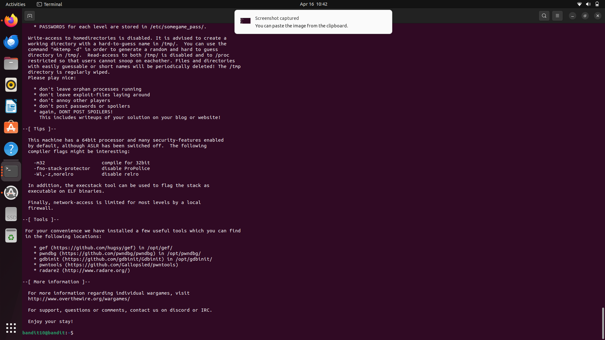

# Bandit Assignment - Krishna Sharma

## Level Walkthroughs
- Level 0: ssh login using bandit0
- Level 1: cat readme
- Level 2: cat ./-
- Level 3: cat "spaces in this filename"
- Level 4: ls -a and cat ...Hiding-From-You
- Level 5: file ./* to find ASCII text
- Level 6: find . -type f -size 1033c ! -executable
- Level 7: find / -user bandit7 -group bandit6 -size 33c 2>/dev/null
- Level 8: grep "millionth" data.txt
- Level 9: sort data.txt | uniq -u
- Level 10: strings data.txt | grep "=="

## Final Result Screenshot

